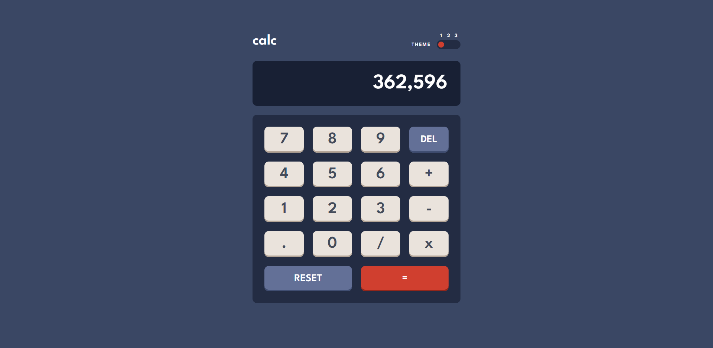

# Frontend Mentor - Calculator app solution

This is a solution to the [Calculator app challenge on Frontend Mentor](https://www.frontendmentor.io/challenges/calculator-app-9lteq5N29). Frontend Mentor challenges help you improve your coding skills by building realistic projects.

- Live Site URL: [Add live site URL here](https://your-live-site-url.com)

## Overview

### The challenge

Users should be able to:

- See the size of the elements adjust based on their device's screen size
- Perform mathematical operations like addition, subtraction, multiplication, and division
- Adjust the color theme based on their preference
- **Bonus**: Have their initial theme preference checked using `prefers-color-scheme` and have any additional changes saved in the browser

## My process

### Built with

- Semantic HTML5 markup
- CSS custom properties
- Flexbox
- CSS Grid
- Mobile-first workflow
- Vanilla JavaScript

### What I learned

For this project I learned how to create themes using CSS custom properties. I also learned how to create a custom toggle switch with CSS. The main challenge of this project was writing the JavaScript for the calculator functionality. My solution is far from perfect, but I was happy to get it working (mostly bug-free).

### Useful Resources

- [Three way toggle by Lokesh Suthar](https://codepen.io/magnus16/pen/grzqMz) - gave me inspiration for creating my toggle switch
